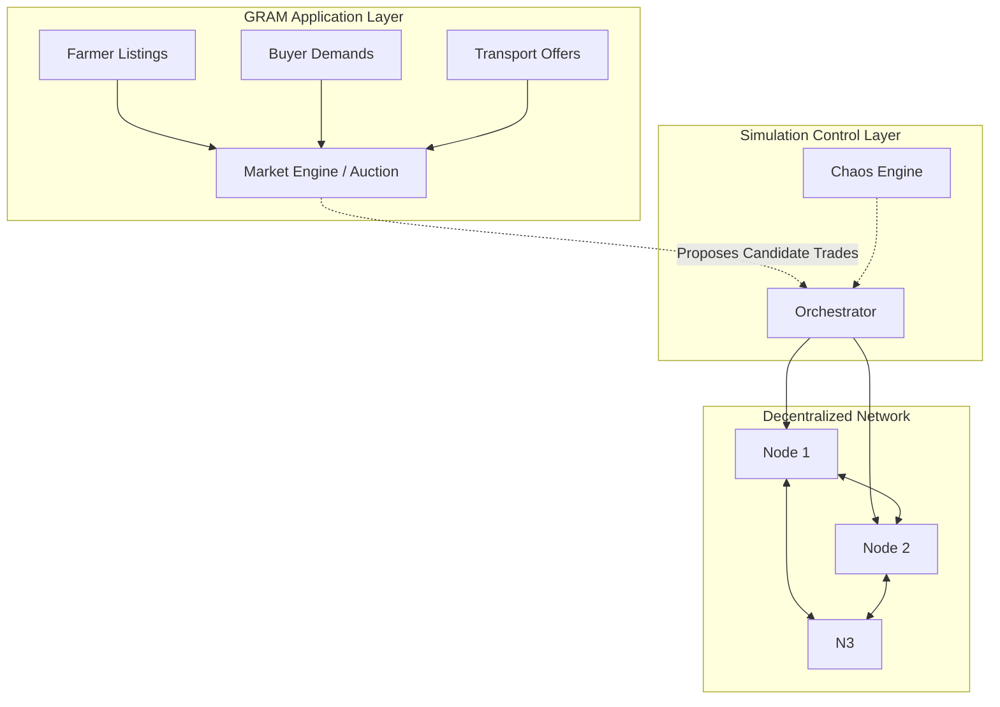
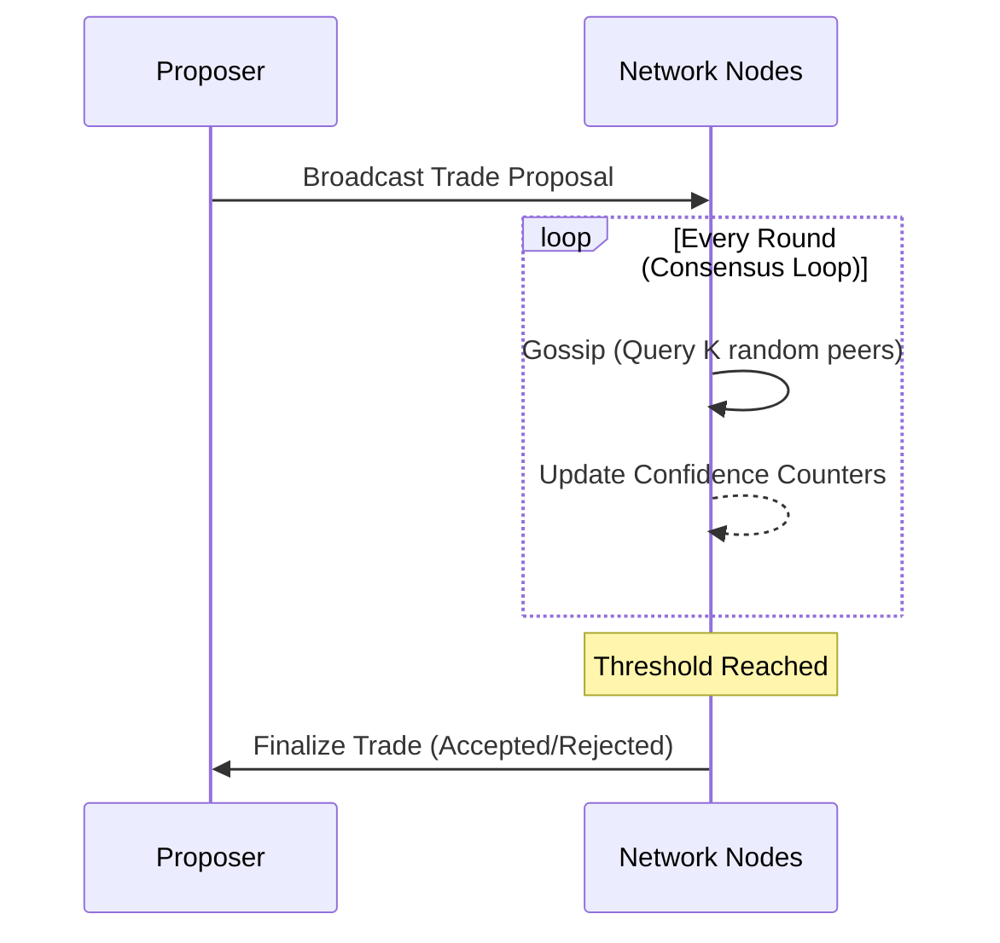
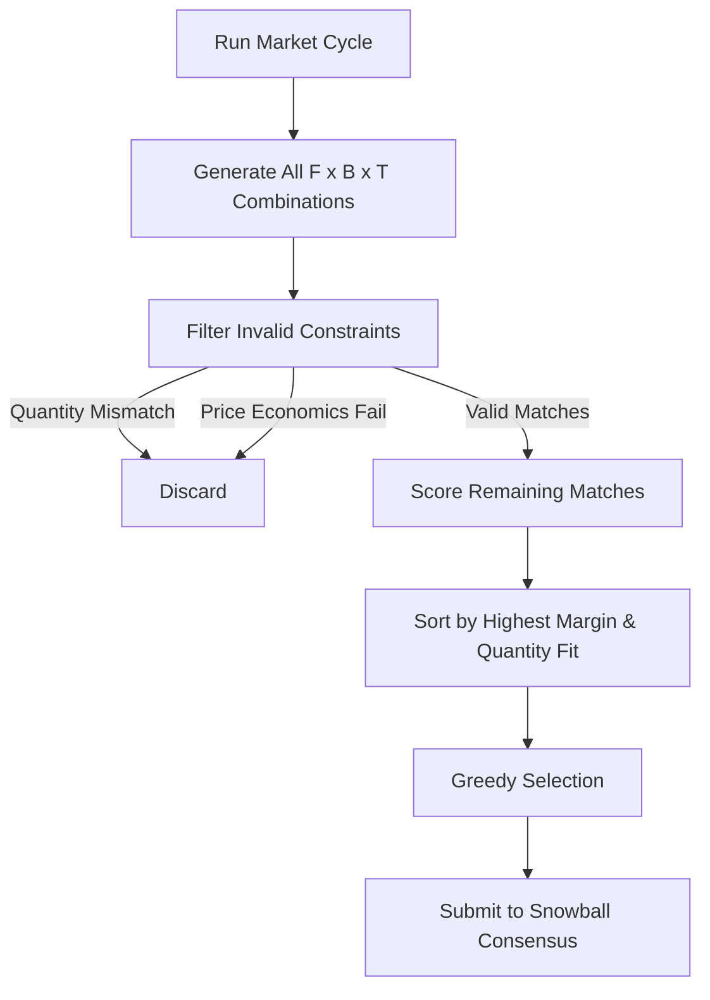
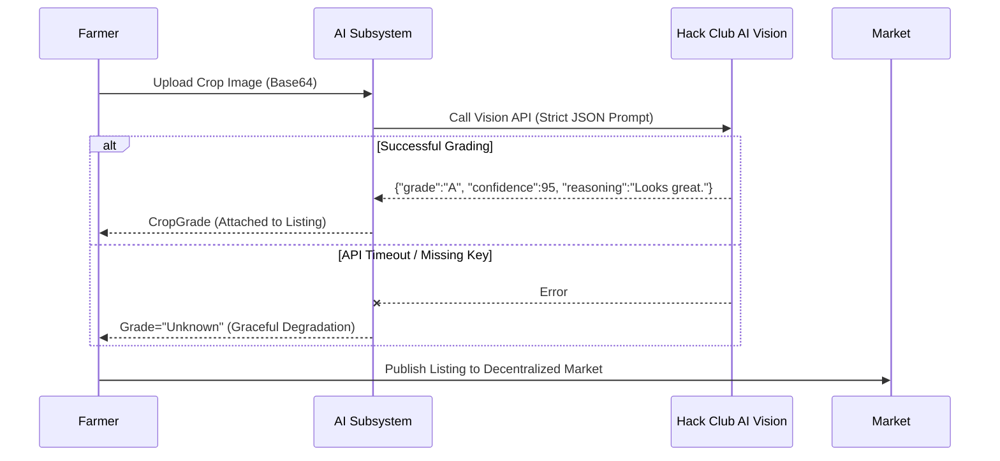
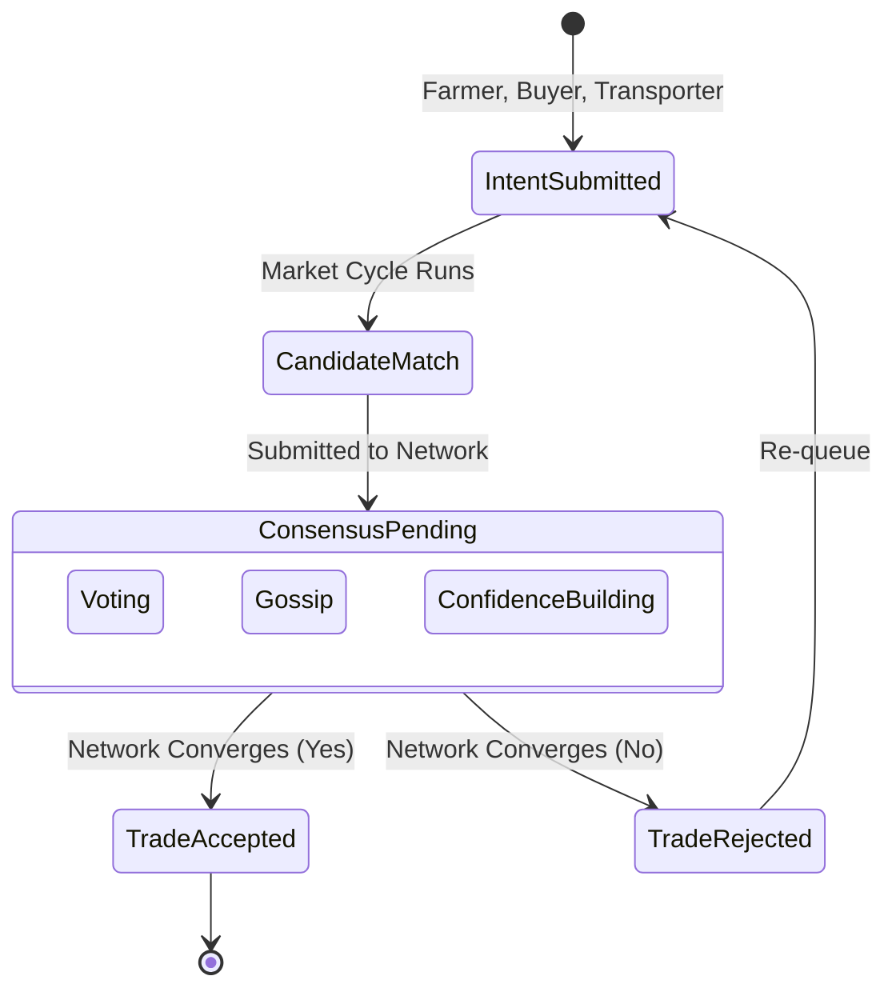

# GRAM Protocol: Gossip-based Resilient Agricultural Mesh

GRAM is a leaderless, decentralized coordination protocol designed for agricultural trade. It enables Farmers, Buyers, and Transporters to negotiate, match, and finalize trades without relying on a central server. 

Built as a robust, resilient distributed system, GRAM can tolerate massive network failures (up to 40% of nodes suddenly dropping offline) and gracefully degrade during API failures, guaranteeing that local agriculture markets never completely halt due to central point-of-failure outages.

## 🚀 Running the Project

The application is split into a Go backend and a React/Vite frontend. Both must be running simultaneously.

### 1. Start the Backend API & WebSocket Server
```bash
cd node
# If you haven't yet:
# go mod tidy
go run cmd/server/main.go
```
*The API will start on `http://localhost:8080`.*

### 2. Start the Frontend Dashboard
Open a new terminal window:
```bash
cd dashboard
# If you haven't yet:
# npm install
npm run dev
```
*The dashboard will start on `http://localhost:5173`. Open this URL in your browser.*

### 3. Running the Demo
Once the dashboard is open:
- Click **"Run Full Demo Trace"** in the top right to simulate a complete cycle: AI grading -> listing -> matching -> consensus -> settlement.
- Use the **Market Entry** panel to inject manual listings and demands.
- Use the **Chaos Controls** to drop offline nodes and watch the network re-converge.

---

## Use Case & Product Overview

In traditional agricultural markets, farmers depend on centralized mandi systems, isolated transport logistics, and opaque pricing engines. This creates systemic fragility: if a central coordination server fails, or if a local authority goes offline, trade grinds to a halt.

**GRAM solves this by decentralizing the market.** 
- **Farmers** list crops with minimum expected prices and AI-graded quality scores.
- **Buyers** submit demands with maximum purchasing limits.
- **Transporters** offer logistics capacity.

GRAM's decentralized nodes calculate combinatorial matches and utilize a probabilistic gossip protocol to finalize trades, ensuring the agricultural economy remains active even in degraded internet or infrastructural conditions.

---

## Core Architecture & Network Flow

GRAM separates the deterministic market economics from the probabilistic network consensus.



---

## 1. Decentralized Snowball Consensus

GRAM does not have a "leader" or "master" node. Instead, it utilizes a custom implementation of **Snowball Consensus** (inspired by Avalanche). Nodes continuously sample a random subset of peers to vote on trade proposals. The network rapidly converges on a decision, achieving agreement even when nodes are dishonest or offline.



---

## 2. Combinatorial Trade Matching Engine

GRAM features an integrated matching engine that resolves supply, demand, and logistics simultaneously. The deterministic engine pairs these efficiently in an $O(F \times B \times T)$ combinatorial cycle and immediately submits candidate trades to the network for decentralized approval.



---

## 3. AI Crop Quality Grading 

Before a crop enters the market, farmers submit a photo for automated grading using the Hack Club AI Vision proxy. The system evaluates visual quality, contamination, discoloration, and visible damage. 

If the AI fails, the node gracefully degrades to an "Unknown" grade and the market cycle continues unblocked, guaranteeing protocol resilience.



---

## Trade Lifecycle

The following state diagram illustrates the journey of an agricultural asset from intent to finalized trade.



---

## Project Structure

```text
/node
├── cmd/
│   └── demo/main.go           # The main simulation execution
├── internal/
│   ├── ai/                    # AI Vision proxy and rigid JSON prompts
│   ├── auction/               # Deterministic matching engine and market cycle
│   ├── consensus/             # Snowball consensus algorithms and trade proposals
│   ├── events/                # Internal event bus for metrics and tracing
│   ├── network/               # P2P Gossip simulator and message routing
│   ├── node/                  # Base node definitions for Farmers, Buyers, Transporters
│   └── orchestrator/          # Chaos engine and network health metric calculation
```
