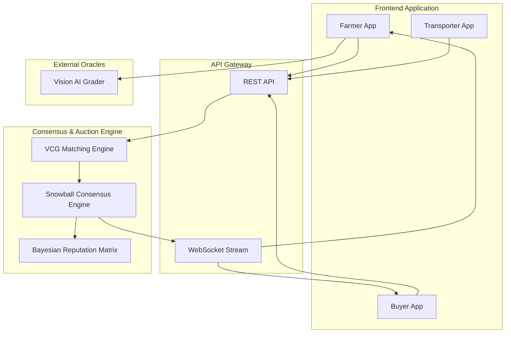

# GRAM: Gossip-Based Resilient Agricultural Mesh

GRAM is a direct agricultural trading platform that connects farmers, buyers, and transporters without middlemen. This repository contains the Phase 0 demonstration of the marketplace web layer, backed by a simulated peer-to-peer (P2P) Go consensus engine. It is a working, mobile-first web application where participants can sign up and complete decentralized trades end-to-end.

## Problem Statement

Indian agricultural trade is dominated by brokers and commission agents who control price discovery, delay payments, and extract significant margins from both farmers and buyers. Small farmers have no direct access to buyers, no visibility into fair prices, and no way to track their produce after it leaves their hands. GRAM removes the broker by providing farmers, buyers, and transporters a shared coordination layer for direct listings, direct orders, and direct tracking.

## System Architecture



## Core Protocols and Academic Principles

The GRAM protocol is built upon several foundational algorithms from game theory and distributed systems literature.

### 1. Snowball Consensus Algorithm
The system uses a leaderless, probabilistic consensus mechanism to validate trades without requiring a centralized authority. When a trade is proposed, nodes sample random quorums of peers to determine the network's preference, continuously shifting state until metastability is broken and consensus is reached.
* **Reference:** Rocket, T., Yin, M., Sekniqi, K., van Renesse, R., & Sirer, E. G. (2019). *Scalable and Probabilistic Leaderless BFT Consensus through Metastability*.

### 2. Vickrey-Clarke-Groves (VCG) Mechanism
To ensure truthful bidding and efficient market clearing, the auction engine utilizes VCG pricing. It computes the optimal assignment of buyers to farmers and charges individuals the social harm they cause to others, mathematically ensuring that bidding one's true valuation is the dominant strategy.
* **References:** 
  - Vickrey, W. (1961). *Counterspeculation, Auctions, and Competitive Sealed Tenders*.
  - Clarke, E. H. (1971). *Multipart Pricing of Public Goods*.
  - Groves, T. (1973). *Incentives in Teams*.

### 3. Shapley Value Cost Allocation
Transport costs are divided among participants using the Shapley value, ensuring a mathematically fair distribution of logistical expenses based on the marginal contribution of each participant to the route's total efficiency.
* **Reference:** Shapley, L. S. (1953). *A Value for n-person Games*.

### 4. Bayesian Trust Reputation
Nodes are assigned a trust score based on their historical behavior (e.g., successful deliveries vs. failed trades). The system utilizes a Beta Reputation framework to continuously update these probabilities, applying a polynomial decay formula to penalize dishonest actors and re-weight their priority in the VCG auction.
* **Reference:** Josang, A., & Ismail, R. (2002). *The Beta Reputation System*.

## Tech Stack

| Layer | Technology | Why |
|---|---|---|
| Frontend | React 18 + Vite | Fast iteration; no SSR required for the demonstration |
| Styling | Vanilla CSS | Maximum control; Capacitor-ready for mobile |
| Auth | Supabase Auth | Built-in Row Level Security, no separate auth server |
| Database | Supabase (PostgreSQL) | Managed database with real-time subscriptions |
| AI | Gemini 1.5 API | Provides vision grading and natural language chat |
| Backend | Go | High concurrency for the Snowball consensus simulation |

## Features

### Farmer Module
* **Create Listing**: Crop type, quantity, unit, quality grade, expected price, location, description.
* **AI Vision Grading**: Upload crop images to receive a deterministic quality grade generated by a Vision AI model.
* **My Listings**: View all listings with live status tracking.
* **Offers**: Review incoming buyer orders and accept or reject each proposal.

### Buyer Module
* **Browse Listings**: Real-time listing catalog; search by crop name, filter by grade and maximum price.
* **Place Order**: Submit quantity inputs validated against available agricultural stock.
* **My Orders**: View order status and confirm delivery when the transporter arrives.

### Transporter Module
* **Vehicle Profile**: Register vehicle type, capacity, and service area.
* **Available Jobs**: Access orders successfully matched between farmers and buyers.
* **Job Execution**: Process accepted jobs through status checkpoints (Picked Up, In Transit, Delivered).

### Shared Capabilities
* **In-app Notifications**: Real-time WebSocket event streams based on consensus state changes.
* **Universal AI Assistant**: A conversational AI embedded directly into the application interface to provide real-time agricultural advice.
* **Language Integration**: Seamless bilingual support (English/Hindi) allowing instant localized text toggling.

## Setup and Installation

```bash
# 1. Clone the repository
git clone https://github.com/your-org/agrinerve.git

# 2. Start the Frontend
cd agrinerve/dashboard
npm install
npm run dev

# 3. Start the Backend Consensus Engine
cd ../node
go mod tidy
go run ./cmd/server
```

## Environment Variables

Create `dashboard/.env` with the following variables:
* `VITE_SUPABASE_URL`: Your Supabase project URL
* `VITE_SUPABASE_ANON_KEY`: Public anon key for Row Level Security authentication

Create `node/.env` with the following variables:
* `HACKCLUB_AI_API_KEY`: Primary key for AI orchestration
* `GEMINI_API_KEY`: Fallback key for robust AI query routing

## Folder Structure

```
agrinerve/
├── dashboard/               # React frontend application
│   ├── src/                 
│   │   ├── components/      # Shared User Interface elements
│   │   ├── contexts/        # Authentication and Localization state
│   │   ├── pages/           # Application views (Farmer, Buyer, Transporter, Admin)
│   │   └── index.css        # Global CSS styling
│   └── supabase_schema.sql  # Database architecture configuration
│
├── node/                    # Go consensus and market engine
│   ├── cmd/                 # Executable entry points
│   └── internal/            
│       ├── ai/              # Vision and Chat language models
│       ├── auction/         # VCG clearing and Shapley routing
│       ├── consensus/       # Snowball leaderless voting protocol
│       └── reputation/      # Bayesian trust mathematics
│
└── README.md                # Project documentation
```

## Known Limitations

* **Payment Processing**: Payment confirmation is a status flag only; no fiat payment gateways are currently integrated.
* **Oracle Integration**: External API polling (e.g., Agmarknet) is stubbed to eliminate external network dependencies during offline demonstrations.
* **Role Isolation**: Accounts are currently limited to a single role per user.

## Roadmap

Future development phases:
* **Phase 1**: Transition simulated nodes to physical libp2p network deployments.
* **Phase 2**: Activate the live Oracle layer for Agmarknet mandi prices and satellite crop verification.
* **Phase 3**: Develop an SMS/IVR fallback architecture for regions with low bandwidth access.
