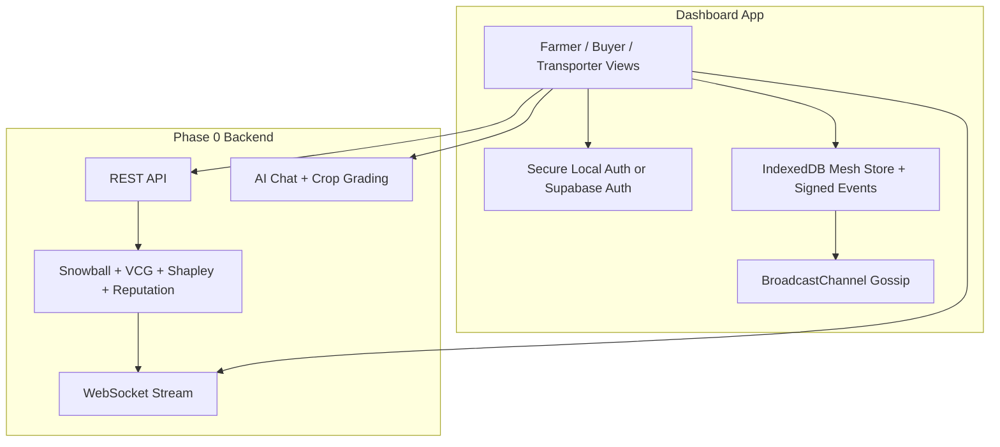

# GRAM: Gossip-Based Resilient Agricultural Mesh

GRAM is a mobile-first coordination app for farmers, buyers, and transporters. The repo is no longer just a Phase 0 demo: it now runs as a hybrid system where the Go backend still simulates the protocol network, while the React app already contains the first local-first Phase 1 pieces needed for a serverless browser mesh.

## Current Status

- **Phase 0 backend is live**: Go still runs Snowball consensus, VCG matching, Shapley cost split, Bayesian trust updates, REST endpoints, and WebSocket streaming.
- **Phase 1 frontend has started**: the dashboard now supports secure local auth, encrypted browser-held mesh identity, IndexedDB-backed mesh storage, same-device gossip over `BroadcastChannel`, and local-first farmer and buyer flows.
- **The app is still mixed-mode**: transporter flows, AI chat/grading, network console, and true cross-device networking still depend on backend services or bridge code.

## Problem Statement

Indian agricultural trade is dominated by brokers and commission agents who control price discovery, delay payments, and extract margins from both farmers and buyers. GRAM is designed to replace that coordination bottleneck with a leaderless mesh where participants act on local knowledge, negotiate directly, and keep trading even when parts of the network go offline.

## Hybrid Architecture



## Tech Stack

| Layer | Technology | Current Role |
|---|---|---|
| App UI | React 19 + Vite + vanilla CSS | Mobile-first dashboard and role-specific flows |
| Local-first runtime | Web Crypto + IndexedDB + `BroadcastChannel` | Secure local auth, keypairs, signed event log, same-device gossip |
| Cloud auth bridge | Supabase Auth | Optional legacy auth path when env vars are present |
| Backend protocol engine | Go | Phase 0 consensus, auctioning, trust, metrics, AI proxying |
| AI | Hack Club OpenAI proxy with Gemini fallback | Chat and crop grading |

## What Works Today

### App
- Farmer listings can be created locally first, signed, stored in IndexedDB, and materialized back into the UI with sync status.
- Buyer orders can be created locally first and follow the same mesh event path.
- Local mesh events gossip across tabs on the same device through `BroadcastChannel`.
- Trust score and network health in the app shell can be derived from mesh events even when the server is not the source of truth.

### Auth
- Users can choose **Secure Local** mode inside the app without Supabase.
- Local accounts are stored only on-device in IndexedDB.
- The passphrase is stretched with PBKDF2 and used to encrypt the local vault with AES-GCM.
- The browser-generated mesh identity is encrypted when local auth is active and the decrypted key never leaves the current tab session.

### Backend-backed features
- AI crop grading and AI chat still call the Go backend.
- Transporter workflows and several trade lifecycle updates still use server-backed endpoints or sync bridges.
- Network console, chaos controls, and global metrics are still driven by the simulated backend mesh.

## Run Locally

```bash
# Backend
cd node
cp .env.example .env
go mod tidy
go run ./cmd/server/main.go

# Frontend
cd dashboard
npm install
npm run dev
```

Frontend runs on `http://localhost:5173`. Backend runs on `http://localhost:8080`.

## Environment Variables

`dashboard/.env`

- `VITE_API_URL=http://localhost:8080/api`
- `VITE_WS_URL=ws://localhost:8080/ws`
- `VITE_SUPABASE_URL` optional; enables cloud auth mode
- `VITE_SUPABASE_ANON_KEY` optional; enables cloud auth mode

If Supabase variables are omitted, the app still works in secure local-auth mode.

`node/.env`

- `HACKCLUB_AI_API_KEY`
- `GEMINI_API_KEY`

## Repo Map

```text
dashboard/
  src/auth/        secure local vault and account lifecycle
  src/identity/    mesh keypair generation and signatures
  src/store/       IndexedDB mesh event store
  src/contexts/    auth and mesh runtime
  src/pages/       farmer, buyer, transporter, auth, admin, science

node/
  cmd/server/      API + WebSocket entrypoint
  internal/
    consensus/     Snowball engine
    auction/       VCG matcher and Shapley cost split
    reputation/    Bayesian trust updates
    api/           REST + WebSocket handlers
    ai/            chat and grading adapters
```

## What Is Not Local Yet

- Cross-device gossip is not live yet; the browser mesh currently uses `BroadcastChannel`, which only works across tabs on the same device.
- The wider mesh event log is not encrypted at rest yet; only the local auth vault and encrypted mesh identity are protected.
- Transporter flows, some offer/trade transitions, notifications, and parts of profile management are still not fully local-first.
- The browser does not run Snowball, VCG, or Shapley yet; those deterministic protocol layers still execute in Go.

## Roadmap

- **Phase 1**: replace same-device gossip with real WebRTC peer networking and move the deterministic protocol core into the app.
- **Phase 2**: remove Supabase auth entirely after recovery/export flows and local-first replacements cover the remaining cloud-backed UX.
- **Phase 3**: add resilient low-bandwidth access patterns such as SMS/IVR without reintroducing central coordination.

## References

- `docs/PHASE_1_SERVERLESS_TRANSITION.md`: detailed migration plan and remaining work.
- `update.md`: running implementation log for the current codebase state.
